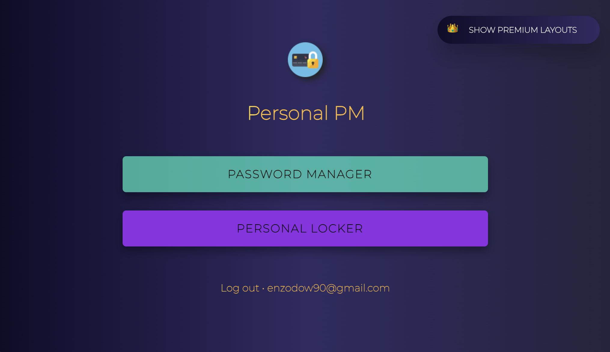

# Personal PM

A secure password manager created with firebase, reactjs, and nwjs

# Environment Setup

1. First, run `git clone "https://github.com/gchaotic9/personal-password-manager.git"` to clone this repository
2. If you are using WINDOWS ONLY, run `npm i` in the main directory to install all necessary packages. If you are using mac, see step 3.
3. If you are using mac, run `npm_config_nwjs_process_arch=x64 npm i` to install all necessary packages. (If you already tried `npm i` or `npm install` by accident, you may have to delete the `node_modules` folder and `package-lock.json` before doing `npm_config_nwjs_process_arch=x64 npm i`)
4. To open the password manager in dev mode, run `npm run dev`
5. To create a build dmg file on MACOS, run `npm install appdmg`, then run `appdmg appdmg.json "path to save file"`
    - So if you want to save the setup dmg file on your desktop, run `appdmg appdmg.json ~/Desktop/PM.dmg`

# Features and Usage Process
- Follow the steps below to create a Personal PM account
    1. Click "Sign in with google" to automatically create an account linked with your google account,
    or click on "Don't have an account? Sign up" to create an account

    2. If you chose not to create an account with google, but created an account manually instead, you will have to check your email for an email verification link (This will most likely be in your spam folder)
    
    3. After verifying your email if you didn't create you account with google, click the "Retry" button, or log out and log back in if that doesn't work

    4. Next, you will be shown two options, Personal PM and Personal Locker. Personal PM is the password manager, and Personal Locker is a place where you can store any files you want onto the cloud. However, Personal Locker is currently not available YET. So click Personal PM to go to the password manager

    5. Next, you will have to create ANOTHER password. This is seperate from your password for your account.
    This is called a master password. It is used to access your stored passwords. When creating your
    master password, you will see a password strength bar under the input field. Please note that the bar
    does NOT have to be full for you to choose that master password, but the color of the bar HAS to be yellow.
    So as long as it's not empty, red, or orange, you can choose that master password.

    6. Now to log out, you can go to settings and click "Log Out" at the top, or to just "Lock", (meaning to NOT sign out of your whole account, but just to go back to the main screen where you select "Personal PM" or "Personal Locker") you can press "Control + L"

- 
